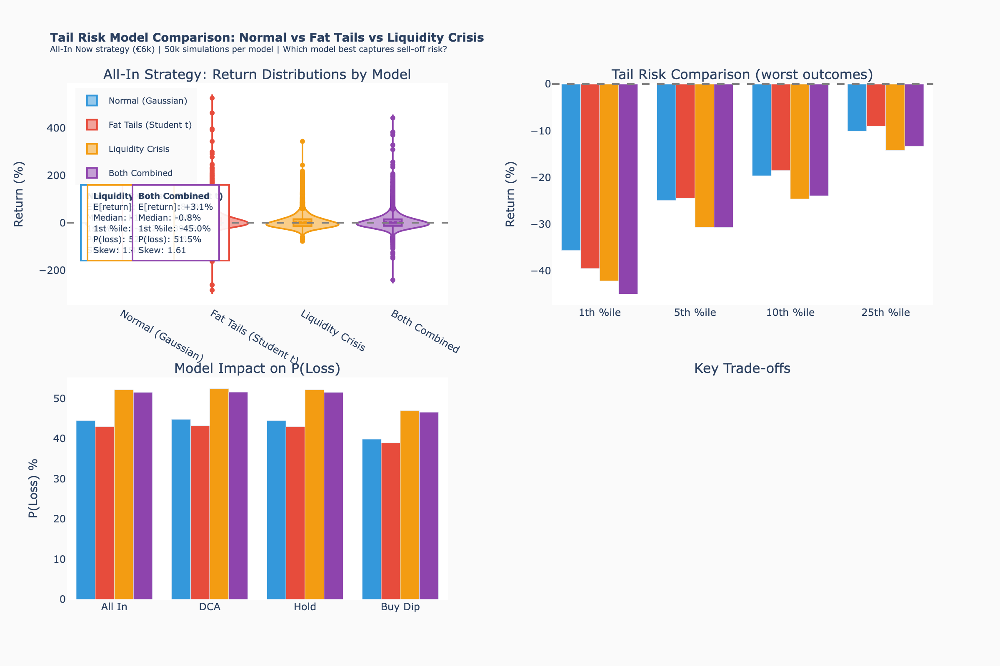

<div align="center">

# GOLDY-LUX

**Gold ETF Scenario Analysis & Decision Engine**

*Markov Chain | Monte Carlo | Sell-Off Risk Modeling | Prediction Tracking*


---

*Should you buy, hold, or sell a gold ETF during geopolitical conflict? This tool models 12 branching scenarios over 3-12 months, simulates 50,000 price paths including forced sell-off risk, and evaluates six investment strategies. It then tracks its own predictions so you can measure how wrong it is.*

</div>

---

## Executive Summary

Two insights drive everything in this model:

**1. Gold is not a reliable safe haven during conflict.** In March 2026, gold had its worst month since 2008 — *during* the US-Iran war. The mechanism: oil shock drove inflation expectations, pushed up real yields, strengthened the USD, and suppressed gold. "War = gold goes up" is wrong more often than people think.

**2. Gold's biggest short-term risk is a sell-off by the people who own it, not the conflict itself.** In March 2026, $12 billion of ETF outflows, ~60 tonnes of Turkish central bank selling, ~22 tonnes of Russian sales, and institutional margin-call liquidation produced a ~25% drawdown. Gold fell *because* it is liquid — institutions sold it first to raise cash when equity positions collapsed. This "margin-call paradox" also drove a 30% drawdown during the 2008 financial crisis.

The model captures both effects. When sell-off risk is included (the default), the picture is notably less rosy than a naive analysis would suggest:

### What should I do?

<!-- EXEC_SUMMARY_START -->

Three options depending on your risk appetite:

| | If you... | Then... | Expected | Worst 5% |
|-|-----------|---------|----------|----------|
| **A** | Can stomach volatility | **All In Now** — invest remaining cash today | +3.0% | -30.8% |
| **B** | Want a smoother ride | **DCA Quarterly** — invest 1/4 of cash each quarter | +2.3% | -25.6% |
| **C** | Mainly want to avoid losses | **Hold Current** — keep cash on the side | +1.5% | -15.4% |

> _These numbers are re-generated each time `./update_gold.sh` runs. The figures above reflect the model's output at the time of the last update (see Bottom Line below for the latest). The model's inputs are rough estimates — treat these as structured thinking, not precise predictions._

<!-- EXEC_SUMMARY_END -->

**How to read this:** All In Now has the highest expected return (+3.0%) but a coin-flip chance of losing money (51.6%). The only strategy with P(Loss) below 50% is **Buy the Dip** (46.7%) — wait for gold to drop >7%, then deploy. This works because the sell-off model says crashes are temporary buying opportunities, not permanent losses. The margins between strategies are thin (~1.5% spread), which itself is information: **there is no obviously right answer, and anyone who tells you there is hasn't modeled the sell-off risk.**

<div align="center">

<br><em>Scenario tree: 12 terminal outcomes. Node size = probability. Border = recommended action (green=buy, blue=hold, red=sell).</em>
</div>

---

## Bottom Line

<!-- BOTTOM_LINE_START -->

### Updated: 2026-04-23 17:58

**Current Market Snapshot**

| Metric | Value |
|--------|-------|
| Gold (EUR/g) | **130.4** |
| Gold (USD/oz) | **$4,749** |
| Brent Oil | **$103/bbl** |
| EUR/USD | **1.171** |
| Portfolio held | **3,000** |
| Cash available | **3,000** |

**Model Predictions (gold EUR/g)**

| Horizon | Mean | 25th-75th %ile | P(above current) |
|---------|------|----------------|-------------------|
| 3 months | 133.4 | 124.3 - 141.1 | 55% |
| 6 months | 136.3 | 121.8 - 147.3 | 56% |
| 12 months | 142.5 | 117.8 - 159.1 | 57% |

**Key Recommendations**

| Scenario | Action | Detail |
|----------|--------|--------|
| Ceasefire collapses | WAIT | Don't chase spike; buy the 2-4 week pullback |
| Stalemate continues | DCA | Invest 1/3 of available cash per month on dips |
| De-escalation / peace | BUY | Deploy cash aggressively on the dip |
| Wider regional war | SELL | Take profits above ~20% gain; redeploy on pullback |

> _Model validation pending — predictions will be checked after 3+ months of tracking._

<!-- BOTTOM_LINE_END -->

---

## How It Works

### The Geopolitical States

The world is in one of five states. Each produces a different gold market regime:

| State | What it looks like | Gold response | Why |
|-------|--------------------|---------------|-----|
| **Peace** | Full deal, sanctions relief, Strait open | **Down 4%/q** | Risk premium collapses |
| **Detente** | Ceasefire holding, gradual normalization | **Down 1%/q** | Slow unwind |
| **Stalemate** | Frozen conflict, sporadic incidents | **Up 1.5%/q** | CB buying supports a floor |
| **Escalation** | Active strikes, oil disrupted | **Up 3%/q** | Mixed — safe haven vs USD strength |
| **Regional War** | Wider conflict, Gulf states involved | **Up 10%/q** | Panic buying overwhelms macro |

Note the Escalation row: only +3%/q despite active conflict. This reflects the March 2026 reality where the oil-inflation-USD channel suppressed gold. A naive model would put this at +8-10%.

### Markov Chain Transitions

States transition quarterly. The probability of the next state depends only on the current state — this is the Markov assumption. Each row sums to 1.0:

<div align="center">

</div>

**How honest are these numbers?** There is no dataset of "100 similar US-Iran conflicts." The transition probabilities are informed estimates calibrated from Gulf War 1990, Iraq 2003, Soleimani 2020, and the current conflict. They are probably accurate to +-5-10 percentage points. The prediction tracker (below) exists to measure how wrong they turn out to be.

### Scenario Tree

The transitions generate a branching tree: 1 starting state, 3-4 branches at 3 months, 8-10 at 6 months, 12 terminal scenarios at 12 months. Each terminal node has a probability, expected gold price range, and a buy/sell/hold recommendation.

### Monte Carlo Simulation

A single simulation = roll the dice once per quarter through the Markov chain, sample a gold return, see where the portfolio lands. One possible future. Repeat 50,000 times to get a distribution of outcomes.

**Why 50,000?** Monte Carlo error shrinks as 1/sqrt(N):

| Simulations | MC Error | Runtime | Notes |
|-------------|----------|---------|-------|
| 1,000 | ~3% | <1s | Noisy — run twice and results shift |
| 10,000 | ~1% | ~1s | Good enough for any decision here |
| **50,000** | **~0.45%** | **~2s** | Default — cheap, so why not |

**The important caveat:** The transition probabilities are guesses accurate to +-5-10%. The return distributions are calibrated to +-a few percent. A Monte Carlo error of 0.45% is absurdly more precise than either. 10,000 simulations would change no conclusions. The real uncertainty is in the inputs, not the simulation count. You can verify this: set `N_SIMULATIONS = 1000` in `config.py`, run a few times, watch the numbers wobble. Set it to 10,000 and they stabilize. Beyond that, more paths buy you nothing.

For background: [Glasserman (2003), *Monte Carlo Methods in Financial Engineering*](https://link.springer.com/book/10.1007/978-0-387-21617-1) or the [Wikipedia overview](https://en.wikipedia.org/wiki/Monte_Carlo_methods_in_finance).

### Sell-Off Risk: The Part Most Models Skip

A basic model samples gold returns from a normal (Gaussian) distribution each quarter. This misses two things that actually move gold prices:

**Problem 1: Fat tails.** Real financial returns have fatter tails than a normal distribution — extreme moves are more likely than the bell curve says. The model uses a Student's t-distribution (df=4.5) instead, which naturally produces more "surprise" moves in both directions.

**Problem 2: Forced-selling cascades.** In March 2026, gold dropped ~25% not because of geopolitics but because of *who owns gold and why they needed cash*:

| Seller | What happened | Quantity |
|--------|--------------|----------|
| ETF institutions (US) | Margin calls from equity losses forced gold liquidation | $12B outflows (record) |
| Turkey central bank | Sold/swapped gold to defend collapsing lira | ~60 tonnes in 2 weeks |
| Russia NWF | Sold reserves to fund budget deficit | ~22 tonnes |
| Hedge funds | Liquidated profitable positions to cover losses elsewhere | Unknown |

The model captures this with a **liquidity crisis overlay**: each quarter, there is a state-dependent probability (1-12%) that a forced-selling cascade fires, overriding the normal return with a sharp drawdown (~-18% mean). This is calibrated from the 2008 GFC (-30% drawdown), March 2026 (-25%), and the 2013 ETF crash (-15%).

**Do individual investors matter?** No. ETF trading is ~4-5% of daily gold volume ($361B/day average). Retail is a fraction of that. The market movers are central banks, institutional investors, and the derivatives market.

**Can the gold market absorb large sales?** Yes, if phased: the IMF sold 403 tonnes over 18 months in 2009-10 with zero price disruption. No, if concentrated: the UK's "Brown Bottom" (395 tonnes announced at once in 1999) cratered the price immediately. Daily volumes are 5-10x higher now than in 1999, but net directional selling of $15-25B sustained over 1-2 weeks can still produce 10%+ moves.

**The key insight for investors:** Sell-off drawdowns are historically temporary. The 2008 GFC drawdown recovered in 6 months. The March 2026 crash has already partially recovered. These are buying opportunities — which is why "Buy the Dip" has the lowest P(Loss) in the model.

### How much does sell-off modeling matter?

A lot. Here's the same strategy (All In Now, €6k) under four model variants:

| Model | Expected return | 1st percentile | P(Loss) | What it captures |
|-------|----------------|----------------|---------|------------------|
| Normal (Gaussian) | +8.0% | -36% | 44.5% | Baseline — no tail risk |
| Fat Tails (Student's t) | +8.3% | -40% | 43.0% | Fatter tails, symmetric |
| Liquidity Crisis | +3.1% | -42% | 52.2% | Forced-selling cascades |
| **Both (default)** | **+3.0%** | **-45%** | **51.6%** | Fat tails + liquidity crises |

<div align="center">

<br><em>Return distributions, tail risk, and P(Loss) across four model variants. The "Both" model (purple) is the default.</em>
</div>

The liquidity crisis overlay has far more impact than fat tails alone. It cuts expected return from +8% to +3% and pushes P(Loss) from 44% to 52%. Fat tails barely change the picture on their own — they widen the distribution symmetrically, which doesn't much affect strategy rankings.

You can switch models via `RETURN_MODEL` in `config.py`: `"normal"`, `"fat_tails"`, `"liquidity_crisis"`, or `"both"` (default).

### Strategy Evaluation

Six strategies are tested against all 50,000 simulated paths:

| Strategy | Description | Expected | P(Loss) | Best for |
|----------|-------------|----------|---------|----------|
| **All In Now** | Deploy all cash immediately | +3.0% | 51.6% | Maximizing expected return |
| **DCA Quarterly** | Invest 1/4 of cash per quarter | +2.3% | 51.7% | Smoothing entry timing |
| **Buy the Dip** | Deploy cash only on >7% drop | +1.8% | **46.7%** | Minimizing loss probability |
| **Hold Current** | Keep gold, keep cash | +1.5% | 51.6% | Minimizing downside |
| **Sell All** | Exit to cash | 0.0% | 0.0% | Certainty |
| **Tactical** | Buy peace, sell war | -0.4% | 52.2% | (Underperforms — trading costs hurt) |

<div align="center">

<br><em>Top: outcome distributions by strategy. Bottom: risk-return scatter.</em>
</div>

<div align="center">

<br><em>200 sample paths from 50k simulations. Black lines = percentile bands. Right labels = terminal state probabilities.</em>
</div>

---

## Model Validation

The prediction tracker implements a **state machine** for model accountability. Each `./update_gold.sh` run:

1. Fetches current gold/oil/FX prices
2. Validates any past predictions whose target date has passed (comparing predicted range vs actual)
3. Records new predictions for +3m, +6m, +12m
4. Computes cumulative performance metrics (mean error, IQR coverage, directional accuracy)
5. Updates this README with the latest results

If directional accuracy drops below 50%, the model is no better than a coin flip and the parameters need recalibration.

**Tuning:**
1. `TRANSITION_MATRIX` — adjust when geopolitical dynamics shift
2. `GOLD_EUR_RETURNS` — adjust when gold's response to states changes
3. `INITIAL_STATE_PROBS` — update when the current situation changes
4. `LIQUIDITY_CRISIS_PROB` — adjust if sell-off frequency changes
5. Re-run `./update_gold.sh` after any change

---

## Quick Start

```bash
pip install yfinance plotly kaleido numpy pandas

git clone git@github.com:johnusher/goldy_lux.git
cd goldy_lux

./update_gold.sh              # Full analysis (~30s)
./update_gold.sh --quick      # Skip Monte Carlo
./update_gold.sh --push       # Auto-commit and push
```

View results: open any `.html` file in `output/`, or visit [GitHub Pages](https://johnusher.github.io/goldy_lux/).

---

## Configuration

Edit **`config.py`**. The most important settings:

```python
# Your portfolio
PORTFOLIO_HELD = 3000           # EUR currently in gold ETF
PORTFOLIO_AVAILABLE = 3000      # EUR available to invest
ETF_TICKER = "PPFB.DE"         # Your ETF ticker (iShares Physical Gold ETC)

# Which tail risk model to use
RETURN_MODEL = "both"           # "normal", "fat_tails", "liquidity_crisis", "both"

# Liquidity crisis probability per quarter by state
LIQUIDITY_CRISIS_PROB = {
    'PEACE': 0.01, 'DETENTE': 0.02, 'STALEMATE': 0.04,
    'ESCALATION': 0.08, 'REGIONAL_WAR': 0.12,
}
```

All parameters — transition matrix, return distributions, fat-tail degrees of freedom, crisis calibration — are in `config.py` with documentation.

---

## Project Structure

```
goldy_lux/
  config.py                    # All user-configurable parameters
  update_gold.sh               # One-command update
  README.md                    # This file (auto-updated sections)
  src/
    scenario_tree.py           # 12-branch scenario tree
    monte_carlo.py             # MC simulation + sell-off models + strategy eval
    prediction_tracker.py      # Prediction recording & validation
    generate_readme_section.py # Auto-update README sections
  output/                      # Generated charts (HTML + PNG)
  docs/                        # GitHub Pages copies
  data/
    prediction_history.json    # Prediction state machine
    model_metrics.json         # Performance metrics
```

---

## Design Choices

<details>
<summary><b>Why Brent crude oil? (click to expand)</b></summary>

| Benchmark | Hormuz sensitivity | Why / why not |
|-----------|-------------------|---------------|
| **Brent** | **High** — Gulf exports priced off Brent | Captures the full chain: Hormuz disruption → EU energy inflation → ECB → EUR/USD → gold EUR |
| WTI | Lower — US is a net exporter | Understates Gulf disruption impact |
| Dubai/Oman | Highest | Impractical to source programmatically |

</details>

<details>
<summary><b>Why five states? Why quarterly? (click to expand)</b></summary>

**Five states** capture the regimes that produce qualitatively different gold dynamics. Fewer misses the stalemate/detente middle where most probability sits. More requires estimates we can't justify.

**Quarterly** matches the decision points ("should I invest now or in 3 months?"). Monthly would quadruple parameters with no decision gain. Weekly would be false precision given +-5-10% input uncertainty.

</details>

<details>
<summary><b>Where do the return distributions come from? (click to expand)</b></summary>

Calibrated from: Gulf War 1990 (+13% then reversal), Iraq 2003 (buy-rumour/sell-news), Soleimani 2020, and critically the current March 2026 "safe haven failure." The macro mechanism (oil → inflation → real yields → USD → gold) matters more than the headline "war or peace." Central bank buying of 1,000+ tonnes/year provides a state-independent floor. See [Tetlock & Gardner, *Superforecasting*](https://en.wikipedia.org/wiki/Superforecasting) for context on structured geopolitical estimation.

</details>

<details>
<summary><b>Cash earns 0%, EUR/USD is implicit, ETC tracking ignored (click to expand)</b></summary>

**Cash:** EUR cash earns ~3-4% ECB deposit rate. On €3k over 12 months, that's ~€90-120 of unmodeled return. Not negligible, but not decision-changing.

**EUR/USD:** Folded into the gold-EUR return distribution per state. This loses the correlation structure (e.g., in escalation, gold-USD flat but EUR weakens, so gold-EUR rises). The return estimates incorporate this implicitly.

**ETC tracking:** iShares Physical Gold ETC has 0.12% TER, tight Xetra spreads, and minimal tracking error. On €6k over 12 months: ~€7-15 of friction. Negligible at this precision level.

</details>

<details>
<summary><b>Why not fit the model from historical data? (click to expand)</b></summary>

There is no dataset of "200 US-Iran conflicts with quarterly gold returns." Geopolitical events are unique enough that fitting would overfit to irrelevant history. The model uses historical episodes for calibration (order of magnitude) and mechanism validation (does gold actually go up during escalation?), then applies judgment. The prediction tracker exists to measure how wrong that judgment is.

</details>

---

## Limitations

> This is a structured framework for thinking about scenarios, not a crystal ball.

- **Markov assumption**: Next state depends only on current state. Real geopolitics has momentum — six months of stalemate creates different dynamics than fresh stalemate after escalation.
- **Sell-off model is crude**: The liquidity crisis overlay fires independently each quarter. In reality, one crisis can trigger another (cascade risk). The crisis return distribution is symmetric around -18%, but real crashes have complex recovery shapes.
- **Static parameters**: Nothing auto-calibrates from market data. When the world changes, you must manually update `config.py`.
- **No tax**: German Abgeltungsteuer (26.375%) would reduce active strategy advantages. Buy-and-hold looks relatively better after tax.
- **Subjective probabilities**: Different analysts would assign different numbers. The prediction tracker is the accountability mechanism.
- **Central bank selling risk may be undermodeled**: Turkey and Russia are actively selling. If China (2,280 tonnes) or India (822 tonnes) reversed course, the structural floor assumption would break. There is no historical precedent for this — China has only ever bought.

---

## Disclaimer

**This tool is for educational and research purposes only. It does not constitute financial advice.**

All probabilities are subjective model estimates. Past performance does not predict future results. The authors are not financial advisors and accept no liability for investment decisions. Always consult a qualified advisor. This is a public repository — do not commit personal financial data beyond `config.py`.

---

<div align="center">

*Built with Python, Plotly, and a healthy respect for uncertainty.*

</div>
