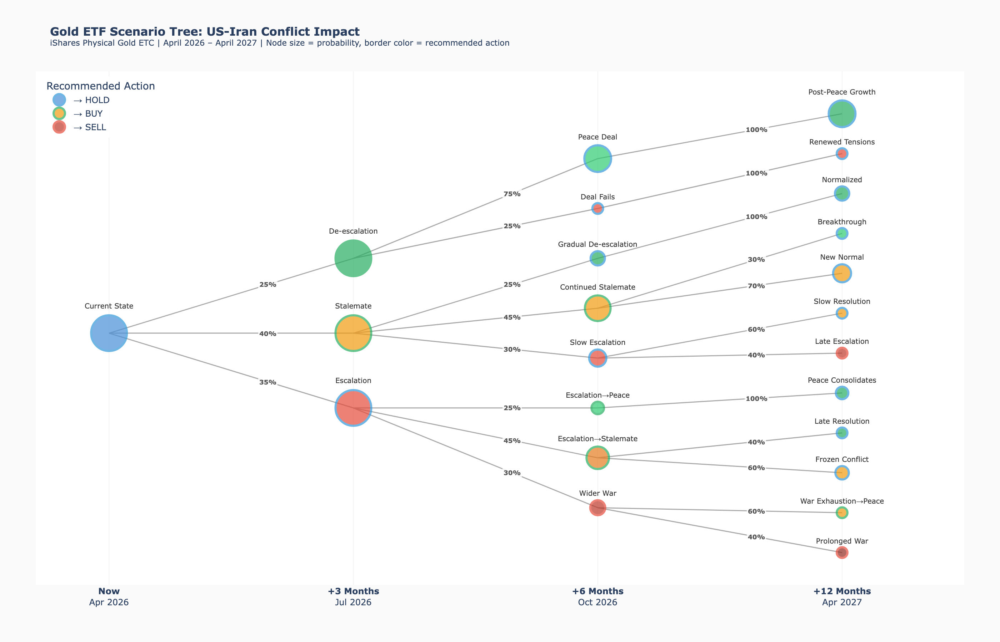
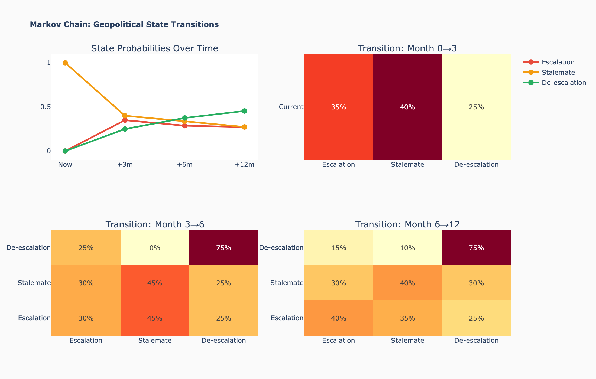
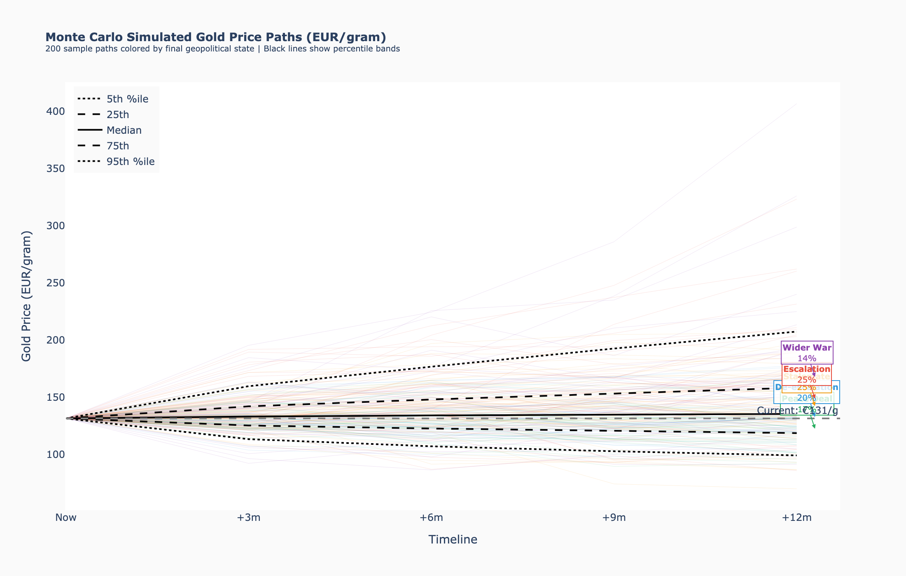
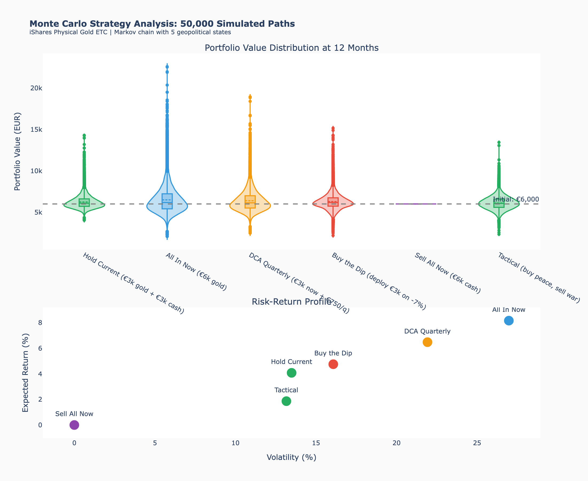

<div align="center">

# GOLDY-LUX

**Gold ETF Scenario Analysis & Decision Engine**

*Markov Chain Modeling | Monte Carlo Simulation | Prediction Tracking*


---

*A scenario-based analysis tool for gold ETF trading decisions during geopolitical conflict. Models 12 branching scenarios over 3-12 months using Markov chain state transitions and Monte Carlo simulation.*

</div>

---

## Executive Summary

> **The core question:** Given ongoing geopolitical conflict, when should you buy, hold, or sell a gold ETF?

Goldy-Lux builds a **branching scenario tree** of geopolitical outcomes (peace, stalemate, escalation, wider war), assigns **Markov transition probabilities** between states, and runs **50,000 Monte Carlo simulations** to evaluate investment strategies.

**Key insight from the model:** Gold does _not_ always act as a safe haven during conflict. Oil shocks can drive inflation expectations, push up real yields, strengthen the USD, and actually suppress gold prices. The relationship is complex and state-dependent.

<div align="center">

<br><em>Scenario tree: 12 terminal outcomes over 12 months. Node size = probability. Border color = recommended action.</em>
</div>

---

## Bottom Line

<!-- BOTTOM_LINE_START -->

### Updated: 2026-04-23 10:40

**Current Market Snapshot**

| Metric | Value |
|--------|-------|
| Gold (EUR/g) | **130.0** |
| Gold (USD/oz) | **$4,732** |
| Brent Oil | **$98/bbl** |
| EUR/USD | **1.170** |
| Portfolio held | **3,000** |
| Cash available | **3,000** |

**Model Predictions (gold EUR/g)**

| Horizon | Mean | 25th-75th %ile | P(above current) |
|---------|------|----------------|-------------------|
| 3 months | 132.6 | 123.5 - 140.2 | 55% |
| 6 months | 135.6 | 121.0 - 146.6 | 56% |
| 12 months | 140.6 | 116.9 - 156.4 | 55% |

**Key Recommendations**

| Scenario | Action | Detail |
|----------|--------|--------|
| Ceasefire collapses | WAIT | Don't chase spike; buy the 2-4 week pullback |
| Stalemate continues | DCA | Invest 1/3 of available cash per month on dips |
| De-escalation / peace | BUY | Deploy cash aggressively on the dip |
| Wider regional war | SELL | Take profits above ~20% gain; redeploy on pullback |

> _Model validation pending — predictions will be checked after 3+ months of tracking._

<!-- BOTTOM_LINE_END -->

---

## How It Works

### 1. Geopolitical State Model

The world is modeled as being in one of **five geopolitical states**:

| State | Description | Gold Impact |
|-------|-------------|-------------|
| **Peace** | Full deal, sanctions relief, Strait open | Negative (risk premium collapses) |
| **Detente** | Ceasefire holding, gradual normalization | Slightly negative |
| **Stalemate** | Frozen conflict, sporadic incidents | Slightly positive (CB buying supports) |
| **Escalation** | Active strikes, oil disrupted | Mixed (safe haven vs. real yield headwind) |
| **Regional War** | Wider conflict, major oil disruption | Strongly positive (panic > macro headwinds) |

### 2. Markov Chain Transitions

States transition quarterly according to a **Markov transition matrix** — the probability of moving to the next state depends only on the current state:

<div align="center">

</div>

### 3. Scenario Tree

The transition matrix generates a **branching tree** of scenarios:
- **T=0** (now): 1 starting state
- **T=3 months**: 3-4 branches
- **T=6 months**: 8-10 branches
- **T=12 months**: 12 terminal scenarios

Each terminal node carries a probability, expected gold price range, and a buy/sell/hold recommendation.

### 4. Monte Carlo Simulation

**50,000 paths** are simulated through the Markov chain, sampling gold returns from state-dependent distributions at each quarter. This gives robust probability distributions for portfolio outcomes under different strategies:

<div align="center">

<br><em>200 sample paths from 50k simulations. Black lines = percentile bands. Right labels = terminal state distribution.</em>
</div>

### 5. Strategy Evaluation

Six investment strategies are evaluated against all 50,000 simulated paths:

| Strategy | Description |
|----------|-------------|
| **Hold Current** | Keep existing gold position, hold cash |
| **All In Now** | Deploy all available cash immediately |
| **DCA Quarterly** | Dollar-cost average over 4 quarters |
| **Buy the Dip** | Deploy cash only if gold drops >7% |
| **Sell All** | Exit gold entirely |
| **Tactical** | Buy on peace signals, sell on war signals |

<div align="center">

<br><em>Top: outcome distributions by strategy. Bottom: risk-return scatter (higher = better return, left = lower risk).</em>
</div>

### 6. Prediction Tracking & Model Validation

Each run records the model's predictions with timestamps. When a prediction's target date passes, it is automatically validated against actual prices:

- **Mean Absolute Error** — how far off the predictions were
- **IQR Coverage** — did reality fall within the predicted 25th-75th percentile band?
- **Directional Accuracy** — did the model correctly predict up vs. down?

This creates a feedback loop to assess and improve model calibration over time.

---

## Quick Start

### Prerequisites

```bash
pip install yfinance plotly kaleido numpy pandas
```

### Run Analysis

```bash
# Clone
git clone git@github.com:johnusher/goldy_lux.git
cd goldy_lux

# Run full analysis
./update_gold.sh

# Quick mode (skip Monte Carlo)
./update_gold.sh --quick

# Auto-commit and push results
./update_gold.sh --push
```

### View Results

- **Interactive charts**: Open any `.html` file in `output/` in your browser
- **GitHub Pages**: If enabled, visit `https://johnusher.github.io/goldy_lux/`
- **Terminal summary**: Printed during `update_gold.sh` run
- **Full report**: `output/analysis_report.txt`

---

## Configuration

Edit **`config.py`** to adjust portfolio and model parameters:

```python
# === YOUR PORTFOLIO — Change these to match your situation ===

PORTFOLIO_HELD = 3000       # EUR currently invested in gold ETF
PORTFOLIO_AVAILABLE = 3000  # EUR available to invest

# === YOUR ETF ===

ETF_TICKER = "PPFB.DE"     # iShares Physical Gold ETC on Xetra
```

All model parameters (transition matrix, return distributions, initial state) are also in `config.py` with documentation. The transition matrix and return parameters are the key knobs for tuning the model.

---

## Project Structure

```
goldy_lux/
  config.py                  # All user-configurable parameters
  update_gold.sh             # One-command update script
  README.md                  # This file (bottom line auto-updated)
  src/
    scenario_tree.py         # Scenario tree model & visualization
    monte_carlo.py           # Monte Carlo simulation & strategy analysis
    prediction_tracker.py    # Record predictions, validate vs reality
    generate_readme_section.py  # Auto-update README bottom line
  output/                    # Generated charts & reports
    *.html                   # Interactive Plotly visualizations
    *.png                    # Static chart images
    analysis_report.txt      # Full text report
    scenario_data.json       # Raw scenario data
  docs/                      # HTML copies for GitHub Pages
  data/
    prediction_history.json  # Prediction tracking state machine
    model_metrics.json       # Latest performance metrics
```

---

## Output Files

| File | Description |
|------|-------------|
| `scenario_tree.html/png` | Interactive branching scenario tree |
| `mc_simulated_paths.html/png` | 50k Monte Carlo gold price paths |
| `mc_strategy_analysis.html/png` | Strategy comparison (violin + risk-return) |
| `mc_optimal_timing.html/png` | When to enter for best risk-adjusted return |
| `historical_context.html/png` | Gold ETC + Brent oil with conflict events |
| `price_heatmap.html/png` | Gold price probability distribution over time |
| `decision_timeline.html/png` | Buy/sell signals across scenarios |
| `markov_transitions.html/png` | Transition matrices & state evolution |
| `strategy_comparison.html/png` | Simple strategy bar chart |

---

## Model Validation

The prediction tracker implements a **state machine** for model accountability:

```
[First Run]                    [Subsequent Runs]
     |                              |
     v                              v
Record predictions            Fetch current prices
for +3m, +6m, +12m          Compare to past predictions
     |                       whose target date has passed
     v                              |
Save to                             v
prediction_history.json      Record validation results
                             Compute performance metrics
                                    |
                                    v
                             Update README bottom line
                             with latest accuracy data
```

**How to assess model quality:**
- After 3+ months of tracking, check `data/prediction_history.json` for validation results
- The README's bottom line section shows current model performance
- If directional accuracy falls below 50%, the model is no better than a coin flip and the transition matrix or return parameters should be re-calibrated

**Tuning the model:**
1. Adjust `TRANSITION_MATRIX` in `config.py` if geopolitical dynamics change
2. Adjust `GOLD_EUR_RETURNS` if gold's response to states differs from expectations
3. Adjust `INITIAL_STATE_PROBS` when the current geopolitical situation changes
4. Re-run `./update_gold.sh` to see the effect

---

## Limitations

> This tool is a structured framework for thinking about scenarios, not a crystal ball.

**Model limitations:**
- **Markov assumption**: The next state depends only on the current state, not history. In reality, geopolitical momentum and path-dependency matter.
- **Normal distributions**: Gold returns are modeled as normally distributed. Real markets have fat tails — extreme moves are more likely than the model suggests.
- **Five discrete states**: The real world is continuous. Forcing it into five bins loses nuance.
- **Quarterly granularity**: Transitions happen continuously, not in 3-month jumps.
- **Static parameters**: The transition matrix and return distributions don't update automatically from market data — they require manual calibration.
- **No interest rates**: Cash earns 0% in the model. In reality, cash in EUR earns the deposit rate.
- **No ETF tracking error**: The model assumes the ETF perfectly tracks gold.
- **No tax effects**: Capital gains tax is not modeled.
- **Correlation structure**: Gold-USD, EUR/USD, and oil dynamics are simplified into a single return distribution per state.
- **Subjective probabilities**: The transition matrix reflects expert judgment, not objective calibration from data.

**Data limitations:**
- Historical data from Yahoo Finance (yfinance) may have gaps or delays
- Gold price in EUR depends on both gold-USD and EUR/USD, each with their own dynamics
- Central bank buying data is reported with a lag

---

## Disclaimer

**This tool is for educational and research purposes only. It does not constitute financial advice, investment advice, or a recommendation to buy or sell any security.**

- All probabilities and predictions are **subjective model estimates** based on scenario analysis
- Past performance does not predict future results
- Gold prices can move in ways not captured by this model
- The authors are not financial advisors and accept no liability for investment decisions made using this tool
- Always consult a qualified financial advisor before making investment decisions
- This is a **public repository** — do not commit personal financial data beyond what is in `config.py`

---

<div align="center">

*Built with Python, Plotly, and a healthy respect for uncertainty.*

</div>
